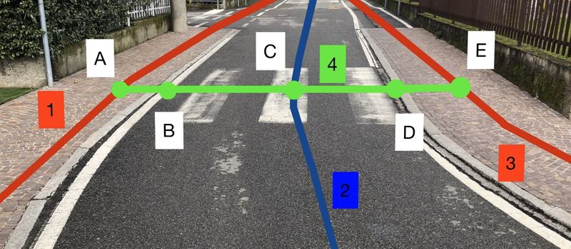

# 📘 Protocolo Técnico de Mapeamento: Av. Centenário (MapAcess)

**Versão:** 1.0 (Remote-First)
**Metodologia:** Baseado em Cazumba (2024) e *ViaLibera* (Biagi et al., 2020).
**Estratégia:** Geometria via Ortofoto PMS 2024 (7,5cm) + Atributos via Street View.

---

## 1. Configuração do Ambiente (iD Editor)

Para garantir a precisão geométrica exigida, não utilize o mapa padrão.

1.  **Fundo (Background):** Selecione "Custom" e insira:
    `https://geo.salvador.ba.gov.br/imageserver/services/Ortofotos/2024/ImageServer/WMSServer?service=WMS&request=GetMap&version=1.1.1&layers=2024&styles=&format=image/png&srs={proj}&bbox={bbox}&width={width}&height={height}`
2.  **Visualização:** Utilize duas abas/telas: uma com o editor e outra com o Google Street View (GSV) para verificação de atributos.

---

## 2. Esquema Topológico de Referência (Geometria)

Para o mapeamento das travessias e conexões, adotamos rigorosamente o modelo topológico do projeto **ViaLibera**.

> **Legenda e Topologia:**
> * **Vias 1 e 3 (Vermelho):** Calçadas (`highway=footway` + `footway=sidewalk`).
> * **Via 2 (Azul):** Eixo da rua (Veículos).
> * **Via 4 (Verde):** Travessia de Pedestres (`footway=crossing`). Deve conectar as duas calçadas.
> * **Pontos B e D:** Meios-Fios/Rampas (`barrier=kerb`). Onde a calçada encontra a travessia.
> * **Ponto C:** Nó da travessia (`highway=crossing`). Onde a travessia cruza a rua.
>
> *Fonte da Imagem: Projeto ViaLibera (Biagi et al., 2020). Licença: CC-BY 4.0.*

---

## 3. Tabelas de Etiquetagem (Tagging)

### 3.1. Calçadas (Sidewalks) - Vias 1 e 3
*Critério: Observação visual do piso e condição via GSV.*

| Elemento | Chave (Key) | Valor (Value) | Critério Visual (GSV / Ortofoto) | Adaptação Cazumba |
| :--- | :--- | :--- | :--- | :--- |
| **Identificação** | `highway` | `footway` | Obrigatório. | - |
| **Subtipo** | `footway` | `sidewalk` | Obrigatório. | - |
| **Superfície** | `surface` | `paving_stones` | Pedras portuguesas, blocos intertravados. | Pavimentado |
| | | `concrete` | Cimento, placas de concreto. | Pavimentado |
| | | `asphalt` | Asfalto. | Pavimentado |
| | | `sett` | Paralelepípedos. | Pavimentado |
| **Condição** | `smoothness` | `excellent` | Novo, sem falhas. | Nota 3 (Ótimo) |
| *(Pavimento)* | | `good` | Estável, poucas emendas. | Nota 2 (Bom) |
| | | `intermediate` | Pedras soltas, desníveis leves. | Nota 1 (Suficiente) |
| | | `bad` | Buracos, raízes expostas. | Nota 0 (Insuficiente) |
| **Largura** | `width` | `<número>` | Medir com régua na Ortofoto (metros). | Largura Útil |
| **Piso Tátil** | `tactile_paving` | `yes` / `no` | Se visível nas fotos. | Acessibilidade |

### 3.2. Travessias (Crossings) - Via 4 e Ponto C
*Critério: Conexão entre os lados da via.*

| Elemento | Objeto | Chave (Key) | Valor (Value) | Critério Visual (GSV) |
| :--- | :--- | :--- | :--- | :--- |
| **Identificação** | Linha (4) | `footway` | `crossing` | - |
| **Tipo** | Nó (C) | `crossing` | `traffic_signals` | Semáforo veicular + pedestre. |
| | | | `uncontrolled` | Faixa de pedestres (zebra) sem semáforo. |
| | | | `unmarked` | Travessia lógica na esquina, sem pintura. |
| **Piso Tátil** | Linha (4) | `tactile_paving`| `yes` | Se houver piso de alerta no início. |
| **Ilha** | Nó (C) | `crossing:island`| `yes` | Se houver refúgio central físico. |

### 3.3. Meios-Fios e Rampas (Kerbs) - Pontos B e D
*Critério: O ponto exato da transição calçada-rua.*

| Elemento | Chave (Key) | Valor (Value) | Critério Visual (GSV) | Classificação |
| :--- | :--- | :--- | :--- | :--- |
| **Barreira** | `barrier` | `kerb` | Obrigatório no nó da borda. | - |
| **Tipo** | `kerb` | `lowered` | Rampa construída ou rebaixamento total. | **Acessível** (Nota 3) |
| | | `flush` | Nivelado (travessia elevada). | **Acessível** (Nota 3) |
| | | `raised` | Degrau alto (> 2cm). | **Inacessível** (Nota 0) |
| **Altura** | `kerb:height` | `<número>` | **Não preencher remotamente.** | - |

### 3.4. Atração e Fachadas
*Critério: Permeabilidade visual e física das edificações.*

| Elemento | Chave (Key) | Valor (Value) | Critério Visual | Indicador Cazumba |
| :--- | :--- | :--- | :--- | :--- |
| **Entrada** | `entrance` | `main` | Porta principal de comércio aberta. | Permeabilidade |
| **Uso** | `shop` | `bakery`, `clothes`... | Vitrines visíveis. | Atração |
| | `amenity` | `restaurant`, `bank`... | Serviços visíveis. | Atração |
| **Altura** | `building:levels`| `<número>` | Contagem de andares. | Densidade |

---

## 4. Fluxo de Trabalho e Boas Práticas

1.  **Priorize a Geometria:** Use a Ortofoto 2024 para desenhar as linhas (vias 1, 3 e 4) com precisão.
2.  **Topologia é Vital:** Garanta que a linha da travessia (4) esteja conectada fisicamente à linha da calçada (1/3) através dos nós de meio-fio (B/D). Se não conectar, o roteamento falha.
3.  **Regra da Incerteza:** Ao verificar atributos no Street View, confira a data da imagem. Se for antiga (<2022) ou estiver obstruída, **não preencha a tag**. Deixe o valor em branco (`NULL`) para validação futura em campo.
